# Lockdown Creatives<br/>T2A2 - Marketplace Project

[bellas-lcm.herokuapp.com](https://bellas-lcm.herokuapp.com)</br>

##### _By Bella Leber-Smeaton_

</br>

#### Requirements:

| Ruby  | Rails | PostgreSQL |
| ----- | ----- | ---------- |
| 2.7.2 | 6.0.4 | 13.3       |

</br>

> **Lockdown Creatives** is a marketplace for arts & crafts kits, and unique experiences. _"Made by artists, for lovers of the arts"._</br>

</br>


</br>

### **R7:** What problem does Lockdown Creatives Markplace solve? <!--Identification of the problem you are trying to solve by building this particular marketplace app. -->

The Lockdown Creatives Marketplace (LCM) app provides a platform for artists and creatives to gain income during locked and a centralised location to purchase artistic goods and services to support the artists we love. </br>

When COVID-19 entered our lives LCM found two major problems that needed solving;

- Our incredible creative industry was locked down and unable to make an income. _How can artists make an income when the arts and entertainment sectors are closed?_ </br>
  Many artists and creatives don't have an online shop to sell themselves or their products, and that's where LCM comes in.
- "We were bored, locked down in our homes and often lacking a creative outlet, all out of ideas or just looking to have some fun."</br> _What are new and fun ways to entertain ourselves in a creative way during lockdown?_ </br> **AND** </br> _How can we best support our arts and entertainment industry?_ </br>
  Many users looking to buy creative kits or artistic experiences don't know where to look as large scale marketplaces don't cater for spatial or conceptual entertainment or art.

### **R8:** Why is it a problem that needs solving?

Whilst larger marketplaces exist they are incredibly broad and not artist centric or built to aid creative entertainment.

We need to provide income opportunities to those who've lost their jobs during the pandemic. By creating a platform that can future-proof by getting artists thinking of their craft 'out-side-the-box', 'outside-of-the-gallery', 'out-side-of-the-theatre', may help them generate a new income field.

The categories are built around interactivity and experiences rather than products and static items. Such as online 'Trivia' hosted by local comedians, and 'Pottery' kits created and guided by Melbourne ceramicists.

### **R9 / R10:** Developer Contact

[Lockdown Creatives Marketplace](https://bellas-lcm.herokuapp.com/) </br>
[GitHub Repo](https://github.com/leberSmeaton/lcm) </br>
[LinkedIn](https://www.linkedin.com/in/bella-leber-smeaton/) </br>

### **R11:** About this app <!--Description of your marketplace app (website), including:-->

**Purpose:** To provide a platform where users can both purchase and sell interactive creative art experiences and kits. To provide a new resource for artists and creatives to generate income during lockdown.

Lockdown Creatives marketplace offers a centralised hub for artistic and creative kits, as well as a higher level of artistic and performative enterprise from the artist by method of zoom class, google hangout comedy show, or collage cut-n-paste online session.

NB: Depending on product requirements, after payment Coordination of dates between buyer and seller are done independently of the app.<br/>

**Functionality / features:**

- Users can create a profile on sign up.
  
- Users can Log in.
  
- Users can Log Out with User Session Deleted.
  
- View Products & Product
  
  
  
- Logged In Users have authorisation to Edit and Delete their products. Assign products to categories and provide stock availability.
  
- Sell Products
  
- View Previous Transactions
  
  <br />

**Sitemap:**


**Target audience:**
Users can be a buyer, seller or both.

- **_User buyer & seller:_** Artist/Creatives.Between 25-45. 70k+

  - Kasia Kerr. 31. Footscray. Graphic Designer, who owns her own business. Partnered with no children. Owns a rescue dog.
  - Mindful. A purchase has to be more than a want, but a need that will benefit mind, body, soul.
  - Disposable income. 80k+. Work not necessarily affected by lockdown.
  - Active online shopper. Lockdown or not, Kasia is constantly browsing.
  - Hipster / or has eye for well designed, thoughtfully created products. "A puzzle from kmart just doesn't cut it."
  - Socially and economically conscious. Doesn't shop at large scale ecommerce like Amazon or eBay. Keeps it as local as possible to benefit other local creatives.
  - **Frustrations:**
    - Browsing across websites and marketplaces to find something unique, creative and well designed.
    - Having multiple sites/marketplaces hosting products not dedicated to her craft.
  - **Goals:** - Have one dedicated marketplace for creatives to both sell and buy products. - To easily give back and purchase products from creatives who've lucked out during lockdown.
    <br /><br />

- **_User seller:_** Artist/Creatives. Between 25-45. 40-70k.

  - Max Mike. 27. Fitzroy. Collage Artist, owns own business and shop front. Single, no children.
  - Lost primary income due to lockdown. Has inactive shop front for business.
  - Can't sell artwork in galleries on or in shop, or do private large scale mural pieces for festivals or businesses.
  - Produces art works and collage kits that are on trend and hipster.
  - Already doing online classes, but they're not well known.
  - Socially active and online.
  - **Frustrations:**
    - Frustrated that can't work and make an income. Not considered 'essential' even when working on private mural commissions.
    - Wants a marketplace that is dedicated to the arts as to attract customers who are looking specifically for creative experiences.
  - **Goals:**
    - Make an income that can potentially roll into regular income after lockdown is over.
    - Create new return customers by offering kits and online sessions.<br /><br />

- **_User buyer:_** Middle to upper SES. Predominantly Female. Between 27-50. 70k+.

  - Clarissa McGreggor. 42. Pasco Vale. Social Services, work has been cut to part time during lockdown. Married with baby. Has pets.
  - Considerate. Wants to help support others in need who've not been able to access gov support.
  - Appreciates the arts. Avid theatre goer.
  - Has a young child so fiddly activities such as puzzles, pottery, collage not ideal fit for household.
  - Wants to liven home activities and make it feel as un-lockdown as possible.
  - Looking for well designed, well stylised, boredom busters that allow you to make beautiful things, or be a part of something magical.
  - **Frustrations:**
    - Lockdown boredom. "Walked all of Pasco Vale".
    - Doesn't feel like they've 'done anything constructive'.
    - No centralised platform for performers and creatives. Doesn't know how to find entertainment from her favourite performer entertainers.
  - **Goals:**
    - Finding an interactive entertainment, primarily online that can be easily purchased with options all in one location.
    - Give back to the industry she loves most, arts & entertainment. Particularly to artists and performers Clarissa loves most.

</br>

#### **Tech Stack**

| Application and Data | Utilities | DevOps  | Business Tools |
| -------------------- | --------- | ------- | -------------- |
| HTML 5               | Stripe    | GitHub  | Trello         |
| CSS                  | Devise    | Git     | G Suite        |
| Ruby                 | Postman   | VS Code | Discord        |
| Rails                |           |         | Balsamiq       |
| Sass                 |           |         | Drawio         |
| PostgreSQL           |           |         | Google Fonts   |
| Amazon S3            |           |         |                |
| Heroku               |           |         |                |

</br>

#### **Next Steps**

- Further Normalise Data
- Personalise User Sessions with 'Hello, "user's name"'
- Tidy up transaction list further. Possibly create a new Orders model to provide user and buyer separate transaction information.
- Add in Contact Messaging Service. If a product is unavailable, contact the Seller to ask questions and see if more will be available.
- Search bar for searching for certain features or buzz words.
- Build in Testing

</br>

### R12 **User Stories**

- **User Seller:** Sam Cambell, Comedian.

  - Selling: online interactive comedy trivia.
    
    Sam is a stand up comedian who's lost all his income for most part of the year due to the comedy festivals country wide being cancelled. <br/>
    Sam wants to sell a new comedy experience, Zoom Comedy Trivia. A trivia night mixed in with his stand up routine. He hopes a taster like this comedy trivia will interest customers to go to future shows. <br/>
    Sam is already logged in due to the cookie session remembering his previous login details.
    He goes straight to SELL to POST/Create a new product of which he has the ability to add a: Category name, Product name, Product description, the price of the session, if the product is available in stock and attach an associated image. <br/>
    When the image is created we are directed to the products SHOW page presenting the information Sam entered. Sam has control and authorisation to edit his own products. <br/>
    Sam is satisfied with his product and awaits purchase to organise with the customer the when and where outside of the platform.
    

- **User Seller & Buyer:** Tantri George, Ceramicist.

  - Ceramicist: selling potting that comes with pre recorded online class.
    
    Tantri has a booming business that can barely keep up but her shop is now closed. Providing kits with a pre recorded class is a quick and easy way for her to keep an income coming through. Whilst Tantri already has her own personal business website having her kits in a central creative marketplace is a great way to expand her customer base. <br/>
    Tantri arrives at the home page and clicks to Log In, where she is redirected back to HOME. Tantri wants to delete a product that isn't performing well and isn't breaking even, her Perfect Pottery class.<br/>
    After heading to ALL PRODUCTS page which indexes all products, Tantri is only authorised to edit and delete her own products. Selecting DELETE on Perfect Pottery Tantri is prompted to reconfirm her decision. The class has been permanently deleted as her product and the destroyed from the database. <br/>
    Before Tantri signs out, she wants to purchase something from her fellow creatives from the MTC breakdancing theatre troupe. The family will learn a Tik Tok dance together. From ALL PRODUCTS Tantri clicks on the card which display SHOWS the singular product and clicks buy now. Buy now directs to Stripe payment page, which she fills out and directs Tantri to a transaction success. Tantri is sent a personal email detailing the success of transaction.
    

- **User Buyer:** Clarissa Smith.

  - Clarissa has done all her puzzles, watched ALL the good films on netflix and just CANT read another book. She wants to find a creative activity that taps in her natural artistic abilities.
    
    Clarissa couldn't find anything on eBay or Amazon that wasn't mass produced or made by local Melburian artists, then came across VIC gov iniative Lockdown MArketplace. Clarissa lands on the HOME page and decides to read up on the About page. There is the option to sign up, log in or see all the product. Clarissa decides to browse the products before she decides to make a purcahse. <br/>
    Viewing all the products, Clarissa decides on a Collage Kit and on click is directed to the dedicated product page which lists all the important information. The product is available and $10, bargain but as Clarissa isn't a user yet so it doesn't give her the option to 'Buy Now' rather to Log in to buy. <br/>
    The Log In page has a link to the Sign Up page which take
    Clarissa signs up as a user and is redirected to the HOME page. (This is an area that the UX/UI could be improved.) Clarissa heads back to the index page of all products, selects a product, goes through the stripe payment process. When Clarissa hits the tranaction success page she clicks through to check her transaction details are all accurate.
    <br/>
    
    <br/><br/>

### R13 **Wireframes**

HOME | root | GET | / <br/>

<br/>ABOUT | about | GET | /about<br/>

<br/>ALL PRODUCTS | products | GET | /products <br/>

<br/>EDIT PRODUCT | edit_product | GET | /products/:id/edit<br/>

<br/>NEW PRODUCT | new_product | GET | /products/new<br/>

<br/>PRODUCT | product | GET | /products/:id<br/>

<br/>PRODUCT EDIT | edit_product | GET | /products/:id/edit<br/>

<br/>SIGN IN | user_session | POST | /users/sign_in<br/>

<br/>SIGN UP | new_user_registration | GET | /users/sign_up <br/>


### R14 <!-- An ERD for your app -->

A ERD is a diagram that describes the relationships between entities. They are considered and created as a business tool as they are to be read to help summarise and help clarify the app in a business sense.

- Initial ERD
  
- Final ERD iteration for 12/08/'21
  
- **Ideas** for Futher Normalisation And Future Database Iteration options that we'd like to next explore include:
  - Generating a Profile model, removing profile information out of User and linking a foreign key to the User table, adding info if the user is also an artist.
  - Feature table that lists features that the products have for better understanding of what the products offer such as: 'kid friendly', 'online', 'kit', 'all-bodies'.
    
    </br>

### R15 **High Level Components** <!-- Explain the different high-level components (abstractions) in your app -->

- **Action Pack:** is our request and response support team and handles the MVC framework of the app. We use the action pack to help define controllers that implement actions in order to define and render our views. Within Rails we're only ever interacting with the Action Controller part of the action pack, where as its other part Action Dispatch is triggered by default in request response and renders action view.
- **Active Model:** is our interface with the Model of the Model View Controller. It allows our Action pack to interact with Ruby objects.
- **Active Record:** helps us associate our classes to our database so we can pull data to and from it. For example our migrations use ActiveRecord to update, change, add and destory data and attributes from our schema table and psql database.
  HEre we can see we can defining class change where we want to add a column specifically called addproductimagetoproducts to our :products table. The column is caled :product_image and it will take a :string
  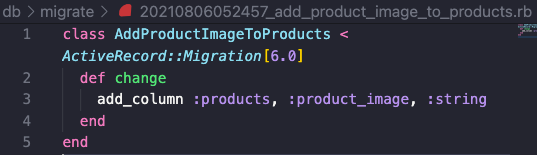
- Action Mailer:
- Active Support:

  </br>

### R16 **Third Party Services** <!-- Detail any third party services that your app will use -->

- SaaS (software-as-a-Service):
  - **Stripe** is a software as a service tool that itegrates with Rails applications. Stripe</br>
    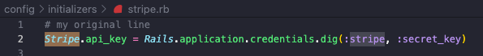</br>
    We ensure our Stripe key credentials are hidden in our rails credentials editor.
    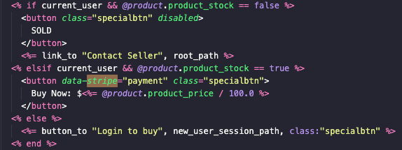</br>
    Our Rails submit buttons are even smart enough to understand that our button is a data-stripe payment.
    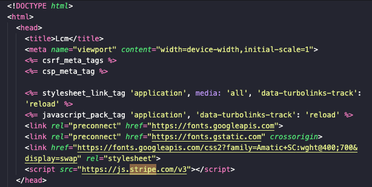</br>
    We use a little bit of JavaScript in the head of the application.html.erb and down the bottom of the page after the body of content that we need stipe to be accessible from.
    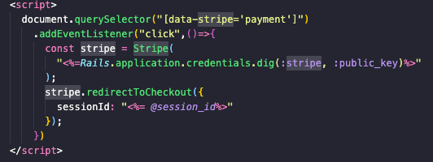</br>
    In our webhook is like the create for our Stripe transaction. it communicates between Stripe and our app.
    Here we can see we are creating a transaction_id variable that contains the data, object payment intent.
    When we create a @transaction we are creating the transaction that called the Stripe Payment intent and it's transaction_id parameters.
    With this informatoin we can link it to our Transactions Mailer which will email the user and buyer. See Gmail Saas belwo.
    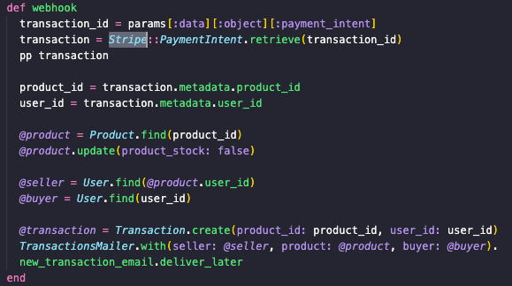</br>
    When we show our product we initiate the stripe session. This isn't good practice, as when ever we visit a product it will kick in the stripe session. Soemthing we'll have to work on in our next sprint. At the end we can see when we get a successful stripe payment we are redirecting to our successurl page which is specific to stripe as to ensure no one can fudge a successful payment.
    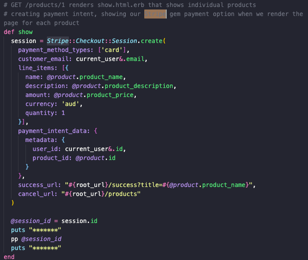</br>
  - **Gmail as active Mailer** is a Saas solution we use to send successful transaction details to our buyer and seller. Action Mailer is also a gem. We ensure our Mailer email and password are hidden in our rails credentials editor. When we install action mailer and set it up it acts like a controller for our transactions to be sent to our users.
    When we set out new_transaction_email we're setting new variabels for our seller and buyer. We can use these now accross our transactions and maielrs.
    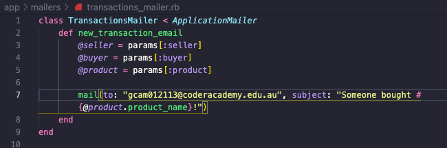</br>
    Our template that is sent to successful purchases.
    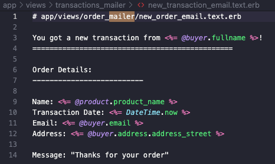</br>
    The Seller has received an email stating someone has purchased their product.
    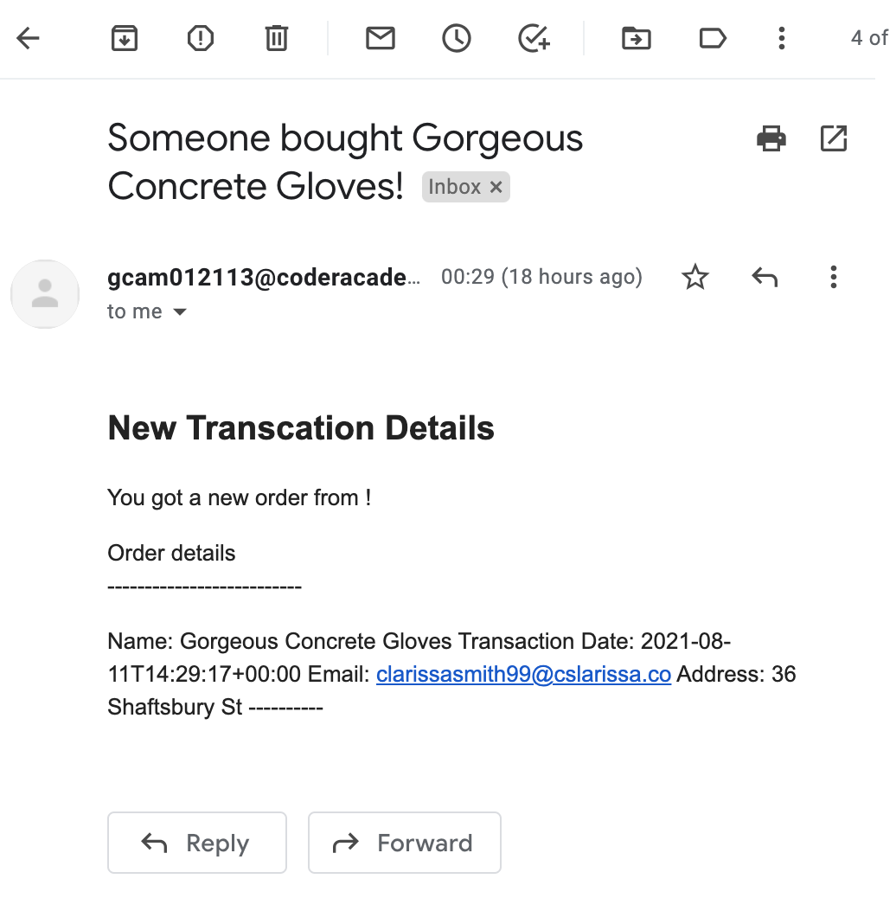</br>
  - There is future opportunity to work with Salesforce as a Customer Relationship Management solution.
- PaaS (platform as a Service):

  - **Heroku** for deployment. Heroku integrates with Git workflow as well as many other tools. It allows us to quickly deploy, build and manage a scaleable app.
    Heroku is like git and managed through the command line. We have to ensure we are conencted and logged in to push and deploy.

    ```
    git add .
    git commit -m"This is a meaningful message. I love Lockdown Creatives."
    git push heroku main
    ```

    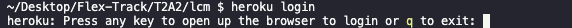
    The Heroku admin dashboard via their website is great and offers many tools such as deployment build logs and a built in console. We can also add buildpacks through heroku and link important Rails authorisation keys.
    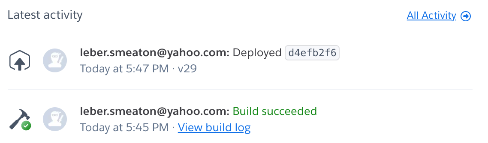

- IaaS(infrastructure as a service):
  - **Amazon S3** for image hosting as it offers highly scalable, secure data cloud storage. We ensure our Amazon key credentials are hidden in our rails credentials editor. As it is widely used Rails has a lot of Amazon tools accessible and just needs to be uncommented in our storage.yml, and in our config>environments>development/production.rb, aswell as installed for active storage access.
    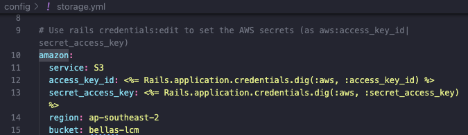</br>
    We need to be sure that our Active Storeage is changed in our config>environments>development / production.rb is changed from :local to :amazon so we don't accidently fill our ®ails storage folder with images.  
    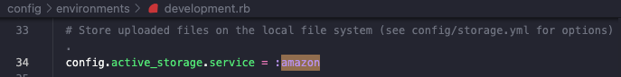</br>
    AWS offers many services such as S3 which lockdown creatives uses as image data storage. Image databases are non relational NoSQL but we can still link through Active Storage through our own PSQL database to the S3 cloud storage.
    We can see we've set up a non public bucket for the lcm marketplace app specific for the Asia Pacific Region that covers Melbourne and the east coast.
    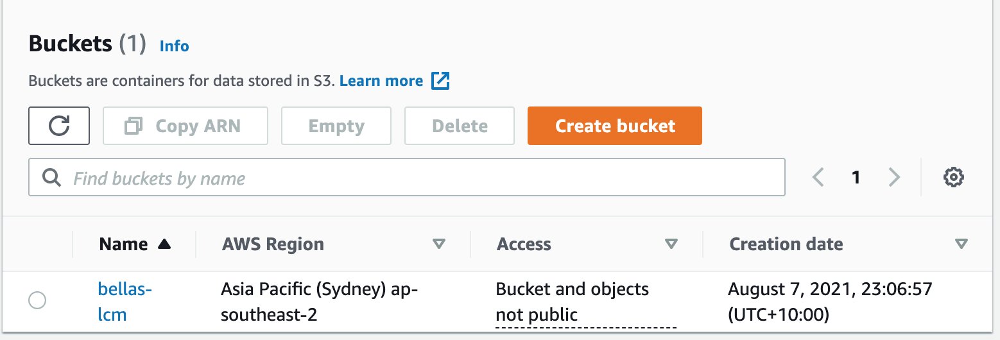</br>

</br>

### R17 + R18 **Database Relations** <!-- Describe your projects models in terms of the relationships (active record associations) they have with each other --> <!-- Discuss the database relations to be implemented in your applicaiton -->

- **Lockdown Creatives Marketplace database Relations**
  List of relation table schemas in the Lockdown Creatives database.
  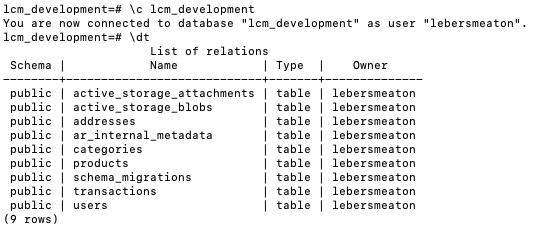
  </br>
- **Schema Foreign Key Relations**
  We can see at the bottom of the schema.rb the lists of foreign keys that have been generated with model and devise, including active storage during its install.
  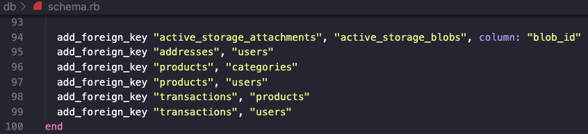
  </br>
- **User Relations**
  The User relationships are between products, address, transaction. We use transactions as a join table represent purchased products Seller and Buyer users.
  We can see that...
  - User has_many :products
  - User has_one :address making it unique to that user
  - User has_many :transactions that we show the many transactions on the transaction history page.
  - we also have purchased products through transaction. Which isn't a schema of it's own, rather identifyies the join between the transaction schema. Which we'll look at below.=
    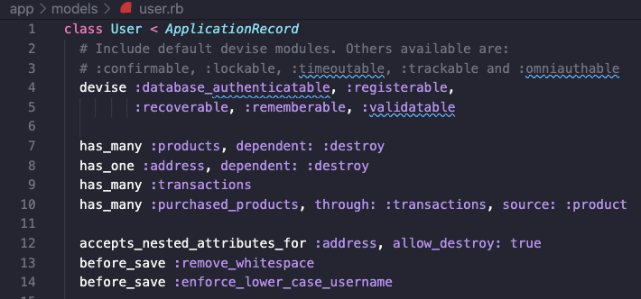
    </br>
    
    </br>
- **Products Relations**
  The products relationships are between the user, category, transactions and active storage models.
  we can see that...
  - Product belongs_to :user and that User has_many :products. The product is only dependent on the user being created. If the user is destroyed we can see that the product too is destroyed.
  - PRoduct belongs_to :category and can only have one category assigned to it. A category on the other hand can have optional one to many product inside it.
  - Product has_many :transactions associated to it. And we use the transaction table to join the prodcut on successful purchase back to the user. In the user table we can see has_many purchased_products, through: :transactions.
  - PRoduct has_one_attached :product_image, which is represented by active storage and it's ataive storage attachement.  
    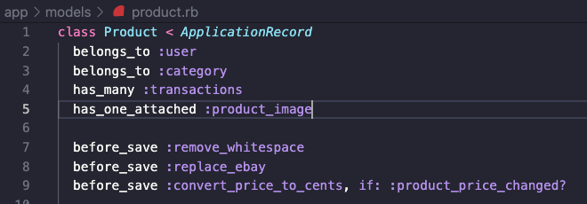
    </br>
    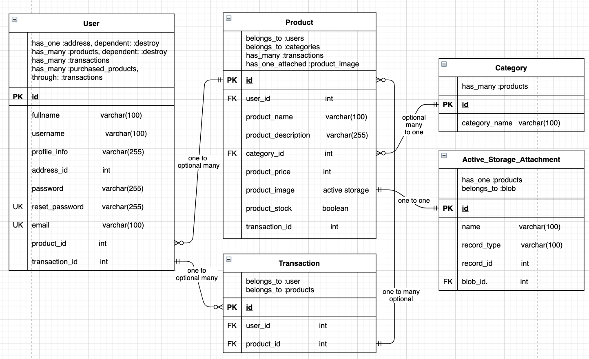
    </br>
- **Addresses Relations**
  The addresses relationships are between user and address.
  - Address belongs_to :user. It is a one to one relationship. An Address is dependent on the user and if the user is destroyed, so too the address.
    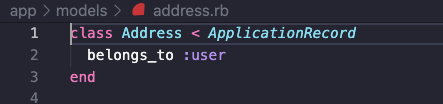
    </br>
    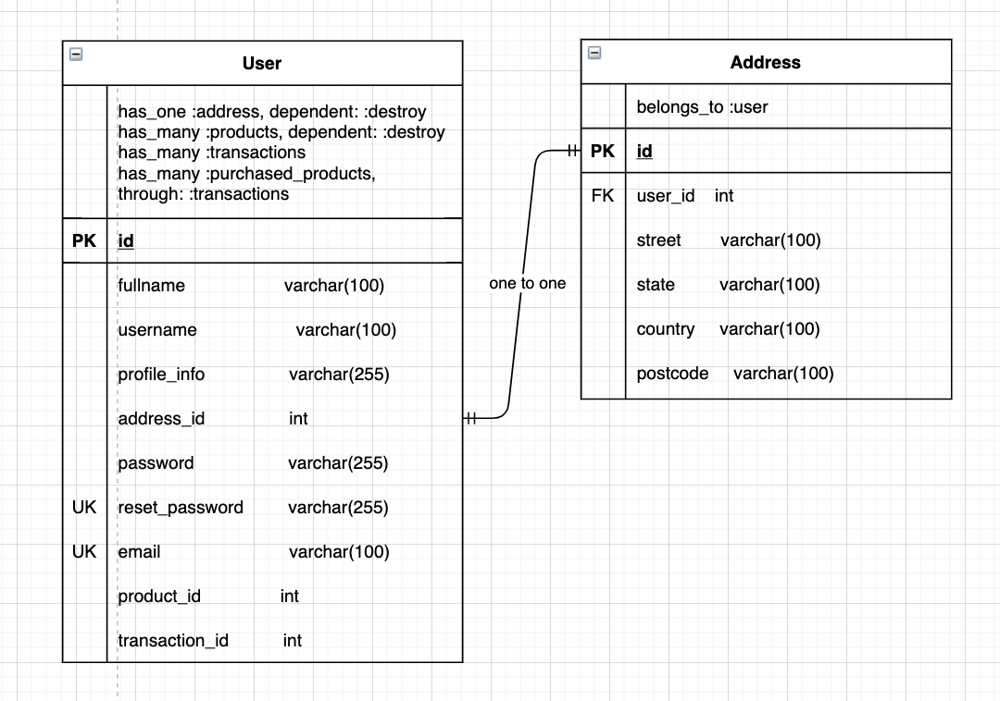
    </br>
- **Category Relations**
  The category relationships are between the product and category.
  - A category has_many :products, an optional one or many products. A category can by empty of products, it can be empty. A product belongs_to one category.
    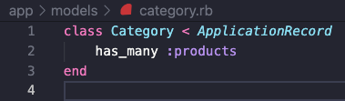
    </br>
    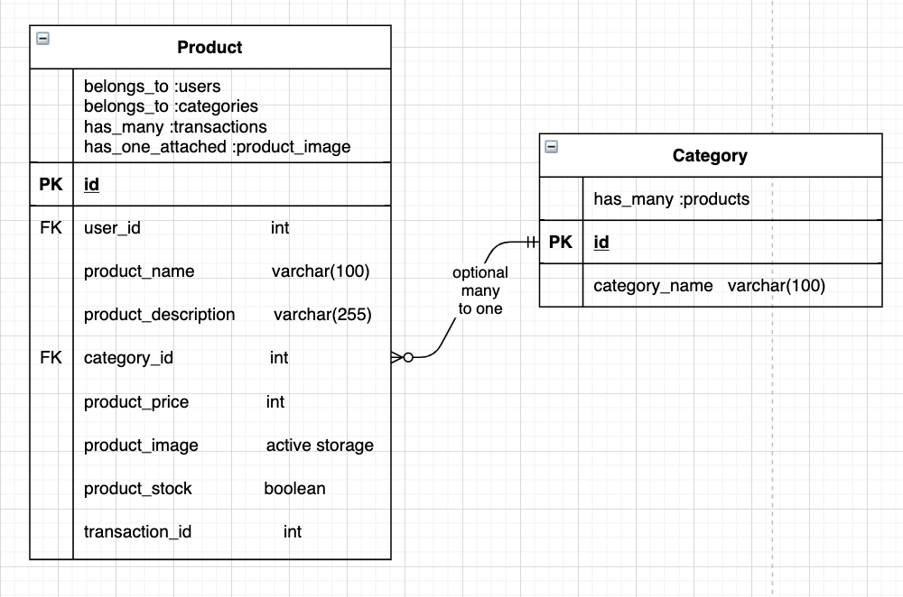
    </br>
    Here we can see the 'collage' category on display for it's specific product.
    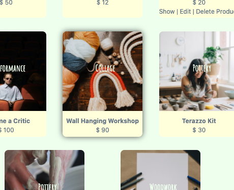
    </br>
    We loop through the categories in a special simple form selection through association.
    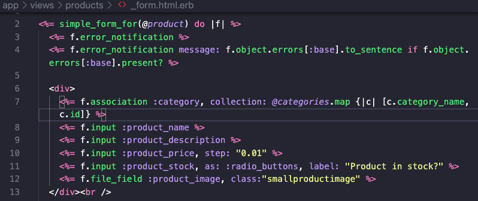
    </br>
- **Transactions Relations**
  The transactions relationships are between user and products and transactions.
  - Transactions is a join table for users and has it's own relationships, user has_many purchased_products, through: :transactions.
  - transactions belongs_to user and belongs_to products.
    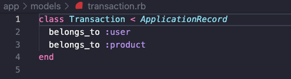
    </br>
    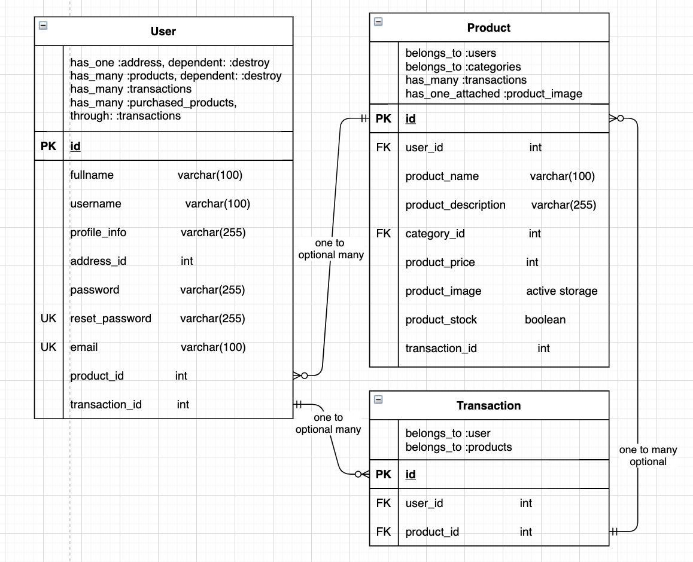
    </br>
    Here we can a mix of user and product information on display because of the relatinoships we've built throught the join table.
    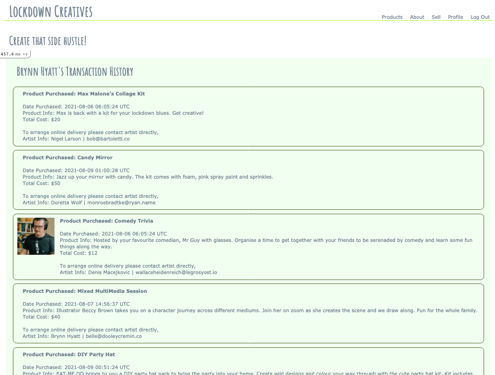
    </br>

### R19 **Database Schema Design** <!-- Provide your database scheme design -->

Blueprint for Lockdown Creatives database
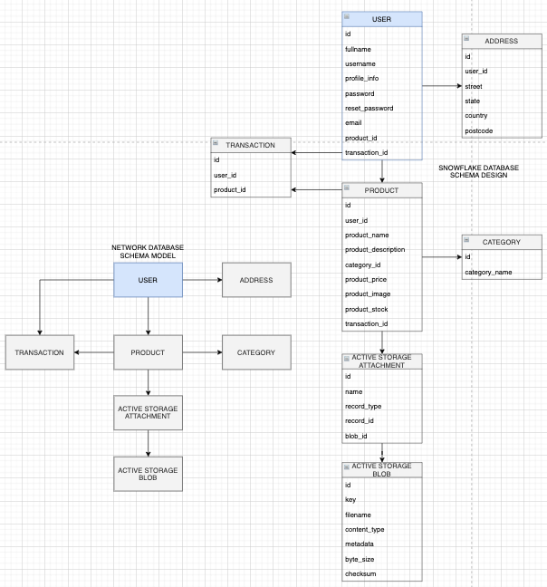

The Database Schema is a 'blueprint' to build databases and a tool for database administrators and developers. A database schema describes how the data will be stored in the database tables. The schema does not show a visual relationships between tables but rather serves a purpose to accurately contain the data.

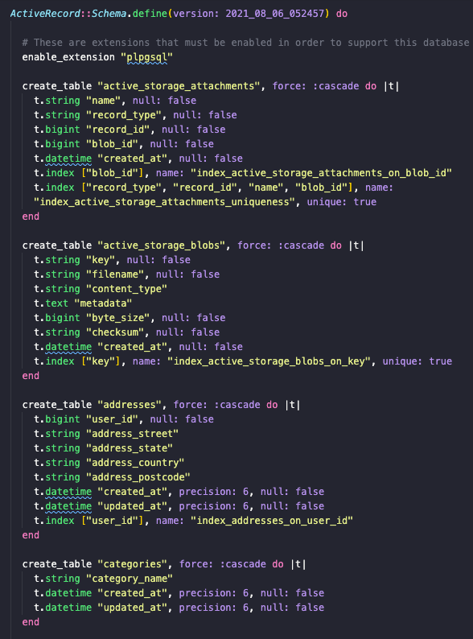

Here we can see how through the psql 'lcm_development' database the list of relations in the lcm-development database.</br>
</br>
The schema is listed in the Rails app as schema.rb. The schema.rb file by rule should never be altered, but rather when we migrate or add/update or delete through migrations we add or change the schema.</br>
When we create a model/ create an active record we add to our schema and it adds the schema table to the psql database, as we see above. </br>
Some gems and tools automatically generate schema tables for us, such as for Lockdown Creatives we used Devise to create our User schema. When we installed active storage it too created Active Storage Attachments and Active Storage Blobs.</br>
At the bottom of the schema the foreign keys are listed, as the database schema doesn't define the relationships between tables, rather shows the entity relationships inside the individual schema tables.
We will go through each schema table separately.</br>

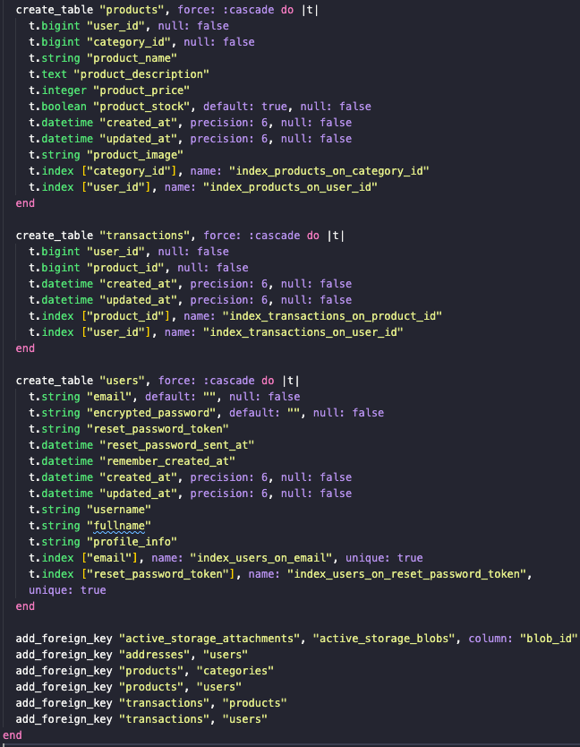</br>

</br> We'll see there are several important attributes that don't have null: false attached to them. These attributes need updating and migrations to improve the quality of the schema datasets. </br>
We do this by rails db:drop dropping the database, performing the migrations on the following schemas to update their constraint to false. Then migrate and seed the database back. For example our migrations might look like this,
</br>

```rails
class AddNullFalseToUsers < ActiveRecord::Migration[6.0]
  def change
    change_column_null :users, :users, :false
  end
end
```

</br>

- **Users**</br>
  To improve data quality we must update and create a new migration for User model 'username' and 'fullname' not null.
  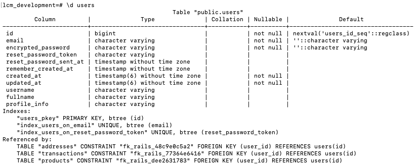</br>
  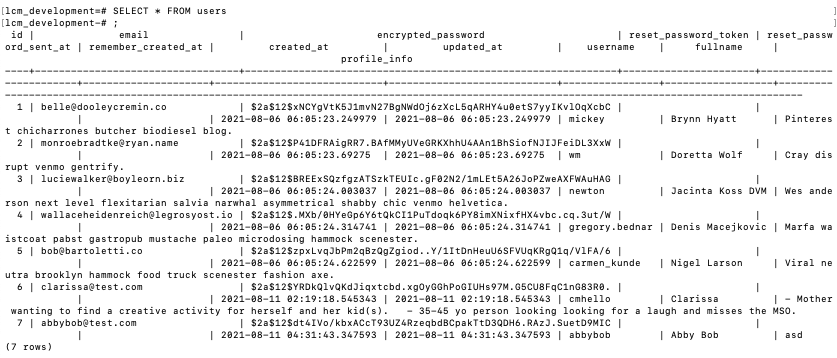</br>

- **Products**</br>
  To improve data quality we must update and create a new migration for Products model 'product_name' and 'product_price' and 'product_stock' and 'product_image' as not null.
  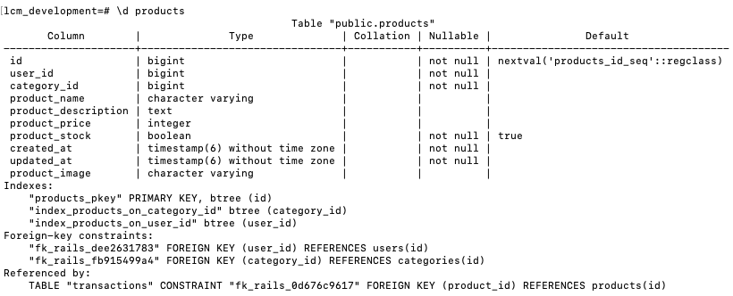</br>
  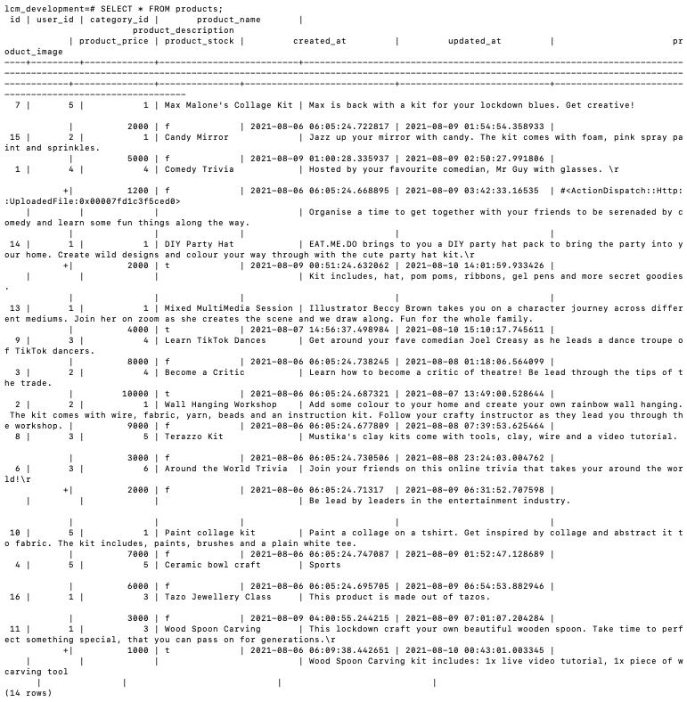</br>

- **Categories**</br>
  To improve data quality we must update and create a new migration for Categories model 'category_name' as not null.
  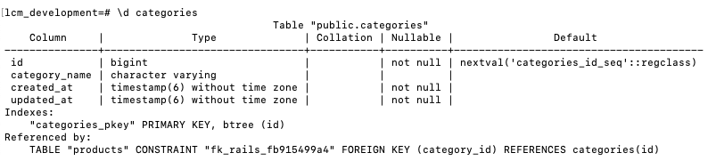</br>
  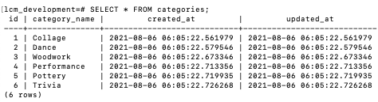</br>

- **Addresses**</br>
  To improve data quality we must update and create a new migration for Addresses model 'address_street', 'address_state', 'address_country', 'address_postcode' as not null.
  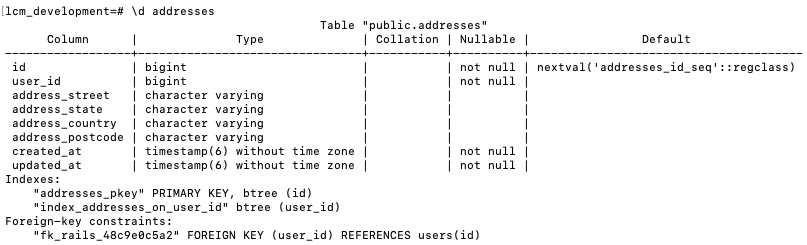</br>
  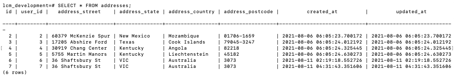</br>

- **Transactions**</br>
  Transactions schema joins the data from Users and Products to gather information when a product is purchased.
  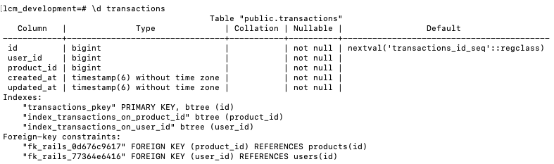</br>
  </br>

- **Active Storage**</br>
  Active storage is how we store our image files for Lockdown Creatives. These images aren't stored locally but their data record is stored in psql.</br>
  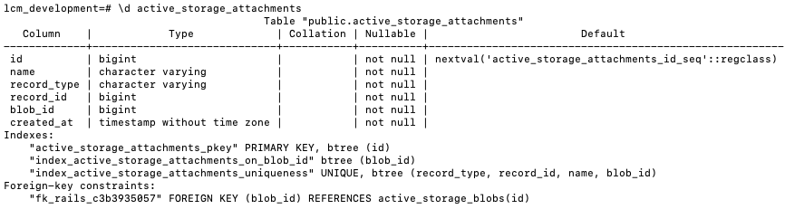</br>
  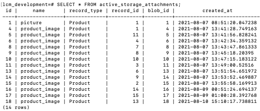</br>
  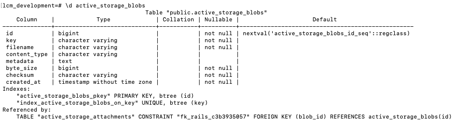</br>
  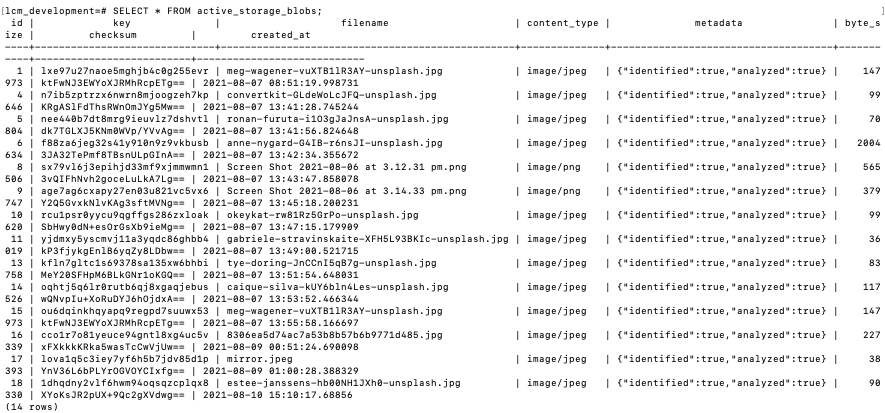</br>

- **Other PSQL tables that aren't schema listed in the app**</br>
  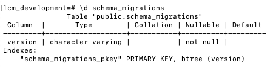</br>
  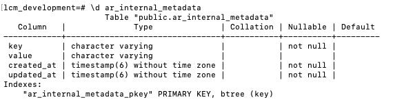</br>

### R20 <!-- Describe the way tasks are allocated and tracked in your project. -->

[LC Marketplace project management](https://trello.com/b/XdQVSKMA/lcm-marketplace)
</br>
The majority of tickets represented a R category from the Assignment. Tickets included both requirements and rubric information. Additionally setting the following helped track tickets and stay on track,

- Checklists for iterations of tickets such as ERD(which required iteration).
- Colour coding to visualise certain sections of the assignment requirements. Such as a requirements R1-6 in yellow to discern from requirements R7-20 and optional prink extras of O1-6.
- Using due dates to set 'sprints' to get work down in short time frames.
- Labels to highlight super important tickets.
- 'Sprinkles' Optional extras that I might want to add or if I have enough time finish implementing.
  </br>
  </br>
  </br>
  </br>
  </br>
  Final Sprint on the home stretch.
  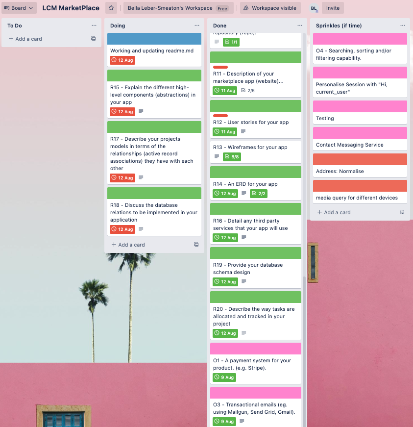</br>
  </br></br>

---

Thank-you

```

```
